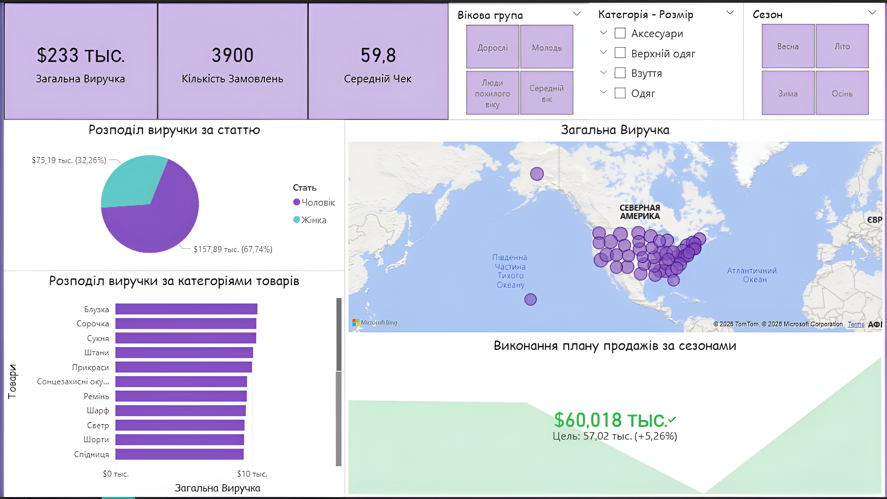

# 🛒 ЕTL-пайплайн: від обробки даних на Python до аналітики в Power BI

## 📌 Огляд проекту
Цей проект демонструє повний цикл роботи з даними (End-to-End). Основна мета — автоматизувати процес очищення сирих даних, структурувати їх у реляційній базі даних MySQL та побудувати інтерактивний дашборд для бізнес-аналітики.

## 🏗 Архітектура проекту (Pipeline)
1. **Extract & Transform (Python/Pandas):** Очищення сирих CSV-даних, виправлення типів, обробка пропусків.
2. **Load (MySQL):** Створення схеми бази даних та завантаження структурованих даних.
3. **Analyze & Visualize (Power BI):** Підключення до бази даних, створення DAX-метрик та візуалізація інсайтів.

---

## 📂 Структура репозиторію
* `data/` — сирі вхідні дані у форматі CSV.
* `scripts/` — Python-скрипт для автоматизації очищення даних.
* `sql/` — скрипти для створення таблиць та аналітичних запитів.
* `dashboard/` — файл звіту Power BI та скриншоти візуалізації.

---

## 🛠 Технічні деталі

### 🐍 Python (Data Cleaning)
На етапі обробки було використано бібліотеку **Pandas**:
* Видалено дублікати та оброблено аномальні значення.
* Приведено дати до єдиного формату.
* Сформовано чистий набір даних для імпорту в БД.

### 🗄 SQL (Database Management)
Дані організовані в MySQL. Основні операції:
* Проектування структури таблиць.
* Написання запитів для перевірки цілісності даних.
* Використання складних запитів (Joins, Group By) для підготовки вітрин даних.

### 📊 Power BI (Business Intelligence)
Кінцевий результат — дашборд, що відображає:
* Динаміку продажів у часі.
* Аналіз прибутковості за категоріями товарів.
* Ключові KPI бізнесу.

---

## 🖼 Візуалізація результату

## 💡 Ключові висновки

* **Автоматизація:** Оптимізовано процес підготовки даних, що значно скорочує час на регулярну аналітику та підготовку звітів.
* **Демографія:** Виявлено домінування чоловічої аудиторії (67,7% виручки). Це вказує на потенціал для розширення жіночого асортименту або перегляду маркетингової стратегії для залучення жінок.
* **Товарні лідери:** Найбільш прибутковими категоріями є верхній одяг (блузки, сорочки, сукні) — кожна категорія стабільно генерує понад $10,000 виручки.
* **Ефективність (KPI):** Зафіксовано перевищення сезонного плану продажів на 5,26% ($60,018 фактично проти $57,020 за планом).
* **Сегментація:** Молодіжна аудиторія в категорії «Взуття» демонструє вищий середній чек ($65,6), що на 10% перевищує загальний середній показник по магазину ($59,8).
